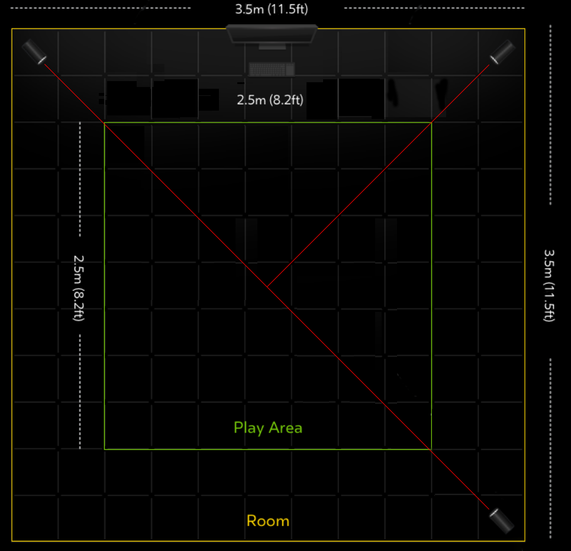

# Oculus Rift Notes

Setup, troubleshooting, and other thoughts on the Oculus Rift CV1.

- [Hardware](#hardware)
- [Current Room Scale Configuration](#current-room-scale-configuration)
- [USB Requirements](#usb-requirements)

## Hardware
### VR Equipment
- Oculus Rift CV1
- Touch Controllers
- 5 Oculus Sensors
- 2x [Cable Matters USB 3.0 Active 5 Meter Extension](http://www.cablematters.com/pc-512-77-superspeed-usb-30-type-a-male-to-female-active-extension-cable-5-meters164-feet.aspx)
- 1x [Cable Matters USB 3.0 Active 10 Meter Extension](http://www.cablematters.com/pc-513-77-superspeed-usb-30-type-a-male-to-female-active-extension-cable-10-meters328-feet.aspx)

### Workstation
All hardware at stock speeds.

- CPU: [Intel 6700K](http://ark.intel.com/products/88195/Intel-Core-i7-6700K-Processor-8M-Cache-up-to-4_20-GHz)
- GPU: [GTX 1070 (Strix 08G)](https://www.asus.com/us/Graphics-Cards/ROG-STRIX-GTX1070-O8G-GAMING/)
- Mainboard: [Asus ROG Maximus VIII Hero](https://www.asus.com/us/Motherboards/MAXIMUS-VIII-HERO/)
- OS: Microsoft Windows 10

### USB Cards
[See USB Requirements](#usb-requirements)

## Current Room Scale Configuration

Sensors mounted 2.4m high

I've tried both 3 and 4 sensor setups. 4 sensor setup is superior. Turning 360 with 3 sensors results in small jitter in same 'blind spot', and is flawless with 4 sensors. 3 sensor might work with 2x2m area.

## USB Requirements
Despite what Oculus says, tracking quality did suffer between USB 2.0 and USB 3.0. I usually test tracking in Quill (Oculus Home) & Tilt Brush (Steam). Doing a slow 360 and some random drawing.

### On-Board USB
#### 1 & 2 Sensors
Works great
- Sensors: Intel Z170 USB 3.0
- HMD: ASMedia USB 3.1 (red port)

#### 3 & 4 Sensors

You will need an additional USB controller for 3 & 4 sensor setups.

### [Inateck KTU3FR-4P](https://www.inateck.com/inateck-ktu3fr-4p-usb-3-0-pci-express-karte-mit-4-usb-3-0-ports.html)

#### 3 Sensors
Works fine. Occasionally get sensor warnings. Replugging or restarting workstation usually fixes this. Small blind spot in corner without camera connected. Probably good for smaller play area.
- 2 Sensors: Inateck Card
- 1 Sensor: Intel Z170 USB 3.0
- HMD: ASMedia USB 3.1 (red port)

#### 4 Sensors
It's.... not that great. Touch input will occasionally jitter and/or fly off in a random direction.

- 2 Sensors: Inateck Card
- 2 Sensors: Intel Z170 USB 3.0 (Or USB 2.0... although I didn't find that it helped at all)
- HMD: ASMedia USB 3.1 (red port)

### [StarTech PEXUSB3S44V](https://www.startech.com/Cards-Adapters/USB-3.0/Cards/PCI-Express-USB-3-Card-4-Dedicated-Channels-4-Port~PEXUSB3S44V)

Installed in 4x slot. I had to set 4x mode instead of auto in mainboard settings for reliable operation.

Use Microsoft auto installed drivers. Drivers available on manufacturer web site will cause the Oculus software to blacklist the card.

#### 4 Sensors
Seems to work great. No sensor communcation warnings. No corner blindspots, jitter, or 'I Must Go, My People Need Me' touch controller antics.

- 4 Sensors: StarTech Card
- HMD: ASMedia USB 3.1 (red port)
